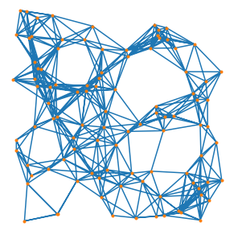

# spmat (Sparse Matrix library)

Besides their uses in physical sciences, sparse matrices are also useful in representing the adjacency matrix of a graph. The spmat library in bale is mostly a collection of functions that act on sparse matrices or graphs. There are also a few functions that act on or create permutations of the numbers {0,..., n-1}.

#### Data Structure
The main data structure in this library is a distributed sparse matrix (implemented as Compressed Sparse Row (CSR)). 
**The rows are distributed to PEs in a round-robin (CYCLIC) fashion and all nonzeros of any given row have affinity to a single PE**. 
NB: This scheme balances the distribution of the matrix across the machine by **rows** not necessarily by **nonzeros**.
The sparse matrix data structure also has a pointer to the local slice of the matrix for each PE. So to look at the nonzeros on your own PE the code looks like this:

```c
sparsemat_t * A;
...
for(i = 0; i < A->lnumrows; i++)
  for(j = A->loffset[i]; j < A->loffset[i+1]; j++)
    column_index = A->lnonzero[j];
```

To look at the nonzeros in a row that is not necessarily local to your PE, the code looks like this...

```c
sparsemat_t * A;
int64_t row;
...
int64_t pe = row % THREADS;
int64_t rowstart = lgp_get_int64(A->offset, row);
int64_t rowstart_next = lgp_get_int64(A->offset, row + THREADS);
for(j = rowstart; j < rowstart_next; j++)
  column_index = lgp_get_int64(A->nonzero, j*THREADS + pe);
```

Note that we use the convention that local slices of distributed
arrays are named the same as the parent array, just prefixed with an
'l'.

#### Values in matrices
Sparse matrices in bale usually do not have explicit stored values. In
that case, we assume every nonzero is a 1. The sparsemat_t data
structure does have the ability to store explicit values as floating
point however for applications that require values.

#### A Graph is a Matrix (and a Matrix can be a graph)
The adjacency matrix of an undirected graph with N vertices is an N by N matrix
where the (i,j) element is nonzero if there is an edge between vertex
i and vertex j. For a directed graph, the element (i,j) is nonzero
if there is an edge **from** vertex i **to** vertex j. In bale, all
undirected graphs are represented by a square lower triangular
matrix. This is the lower half of the symmetric adjacency matrix. A
directed graph is represented by a square matrix.

#### App-like functions
Several functions in this library are instructive enough that they are
implemented in a variety of ways (AGP, exstack, exstack2, and
conveyors). Those functions are transpose_matrix, permute_matrix, and
randpermp (create a random permutation of {0,...,n-1} in parallel).

## Matrix/Graph generation
* Flat uniform (uses Erdos-Renyi model)
* Geometric Random Graph (see [wikipedia/RandomGeometricGraph](https://en.wikipedia.org/wiki/Random_geometric_graph))
* Kronecker Product Graphs
* I/O using Matrix Market format

#### Erdos-Renyi
The Erdos-Renyi random graph model with parameter p for
n vertices flips a weighted coin (heads with probability p) for every
potential edge in the graph. The edge is inserted into the graph if
the coin flip results in a heads, and left out otherwise. In
matrix-speak, we are generating the lower-half of the adjacency matrix
of a graph and inserting a 1 for each heads and a 0 otherwise. The
pseudo-code :

    for i = 0...n
      for j = 0...i
        if(random() < p)
          A[i][j] = 1
        else
          A[i][j] = 0

Generating a large graph according to this psuedo-code is inefficient
as it requires O(n^2) random numbers to be generated. A better way is
found in the paper, "*Efficient Generation of Large Random Networks*" by
Bategeli and Brandes. This uses the fact that the geometric
distribution models the number of tails between two heads. We have
implemented both the naive and the more efficient algorithms in
bale. Also note that one can create a directed graph with this model
but flipping a coin for each potential directed edge between two
vertices.

#### Geometric Random Graphs



This random graph model is rather simple. Similar to the Erdos Renyi
model, it has a single parameter r (between 0 and 1). For each vertex,
a point is randomly placed in the unit square. An edge is placed
between vertices i and j if the points corresponding to these vertices
are within distance r of each other. To generate a graph under this
model we break the unit square into square sectors (usually of length
and width r). This reduces the number of interpoint distances we need
to calculate since edges can only exist between points in the same
sector or in neighboring sectors (including diagonally neighboring).

These graphs present an interesting alternative to the Erdos-Renyi
random graph. Their generation in parallel is also interesting in its
own right. The assignment of points to PEs during the edge generation
in order to reduce the amount of communication is an interesting
discussion, as is the assignment of rows of the adjacency matrix once
the edges are determined. These need not be the same and in fact it
would be difficult to make them so given the requirement of bale's
sparse matrix data structure that the rows of a matrix
must be evenly distributed to the PEs (with any remainder rows going
to the lowest indexed PEs). Our current implementation assigns sectors
to PEs in a BLOCK fashion and places sectors in lexiographic order by
column (starting with the left side of the unit square) and then row
(starting with th e bottom of the unit square).

While we know there exist communication-free algorithms for generating
geometric random graphs, we decided to implement an algorithm that
requires communication. Why? Bale is primarily about improving the
lives of distributed parallel programmers. The communication free
algorithm is not representative of an algorithm a researcher would
think of on his/her first attempt. We want to see how different
parallel programming models behave under the kinds of algorithms that
people write as they evolve their algorithms.

#### Kronecker Product Graphs

We chose to implement Kronecker product graphs in bale to test out our Triangle counting implementations.
For more details see "*Design, Generation, and Validation of Extreme Scale Power-Law Graphs*"
by Kepner et. al. for more details. The parallel generation of these graphs is not particularly challenging or interesting.

#### Matrix Market I/O

The spmat library has the ability to read matrices in Matrix Market format. This function reads the matrices in serial using one PE and then distributes the resulting matrix to all PEs. For
this reason it is not meant to scale to large matrices, but it is
useful for debugging or sanity checking on known examples.

#### Parallel I/O

The spmat library has functions to read and write a binary dataset for sparse matrices (that is not standard). See the [sparse_matrix_io](../apps/sparse_matrix_io_src/README.md) app for more details.
